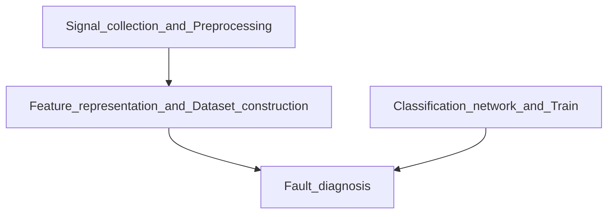

<picture>
 <source media="(prefers-color-scheme: dark)" srcset="[YOUR-DARKMODE-IMAGE](https://user-images.githubusercontent.com/25423296/163456776-7f95b81a-f1ed-45f7-b7ab-8fa810d529fa.png)">
 <source media="(prefers-color-scheme: light)" srcset="[YOUR-LIGHTMODE-IMAGE](https://user-images.githubusercontent.com/25423296/163456779-a8556205-d0a5-45e2-ac17-42d089e3c3f8.png)">
 
</picture>

# About me
> Stay hungry, stay foolish.
— Steve Jobs
<!-- TO DO: add more details about me later -->


Hi, I'm Yang Chen.

- 🔭 I’m currently pursuing postgraduate degree.
- 🌱 I’m currently learning signal processing, voiceprint recognition, data sicence and artificial intelligence.
- 📫 How to reach me: chen1052554665@gmail.com

<details open>
<summary>My top languages</summary>
  
| Rank | Languages |
|-----:|---------------|
|     1| Python          |
|     2| Matlab        |
|     3| C          |
|     4| C++         |
|     4| Java        |
|     5| Shell          |
</details>

Here is a simple flow chart for my research.
<!-- The mermaid can not input space. -->


---
> 纸上得来终觉浅 绝知此事要躬行
## 🎯 Forks and Stars
Notion + Obsidian 双模板体系

### 📚 Deep Learning
| 项目 | 链接 | 状态 | 是否Fork | 优先级 | 备注 |
|------|------|------|----------|--------|------|
| awesome-knowledge-distillation | https://github.com/dkozlov/awesome-knowledge-distillation | ❌未整理 | ❌ | ⭐⭐ | 知识蒸馏资源合集 |
| deep-learning-for-image-processing | https://github.com/WZMIAOMIAO/deep-learning-for-image-processing | ❌未整理 | ❌ | ⭐⭐⭐ | 图像处理深度学习教程 |


---

### 🔊 Acoustic
| 项目 | 链接 | 状态 | 是否Fork | 优先级 | 备注 |
|------|------|------|----------|--------|------|
| RIR-Generator | https://github.com/ehabets/RIR-Generator | ❌未整理 | ❌ | ⭐⭐⭐⭐ | 房间脉冲响应生成（阵列关键） |


---

### 📄 Paper / Experiments

| 项目 | 链接 | 状态 | 是否Fork | 优先级 | 备注 |
|------|------|------|----------|--------|------|
| gpuRIR | https://github.com/DavidDiazGuerra/gpuRIR | 💡可用 | ✔ | ⭐⭐⭐⭐⭐ | 可用于论文/实验（强相关） |
| sciwrite | https://github.com/labarba/sciwrite | ❌未看 | ❌ | ⭐ | 学术写作工具 |
| next-ai-draw-io | https://github.com/DayuanJiang/next-ai-draw-io | ❌未整理 | ❌ | ⭐⭐ | AI流程图工具 |


---

### 📝 Examination

| 项目 | 链接 | 状态 | 是否Fork | 优先级 | 备注 |
|------|------|------|----------|--------|------|
| software_designer | https://github.com/xiaomabenten/software_designer | 🔄进行中 | ❌ | ⭐⭐⭐ | 软件设计师备考 |
| Software-Designer | https://github.com/luckyzhz/Software-Designer | 🔄进行中 | ❌ | ⭐⭐⭐ | 软件设计师资料 |
| my-ielts | https://github.com/hefengxian/my-ielts | 🔄进行中 | ❌ | ⭐⭐ | 雅思学习 |
| awesome-IELTS | https://github.com/shah0150/awesome-IELTS | 🔄进行中 | ❌ | ⭐⭐ | 雅思资源合集 |


---

### 🚀 Forked and Achieved


| 项目 | 链接 | 状态 | 是否Fork | 优先级 | 备注 |
|------|------|------|----------|--------|------|
| magic-resume | https://github.com/JOYCEQL/magic-resume | ✅已复现 | ✔ | ⭐⭐⭐ | 简历生成工具 |
| markitdown | https://github.com/microsoft/markitdown | ❌未整理 | ❌ | ⭐⭐ | Markdown处理工具 |


---

Stars:
* 觉得有价值
* 未来可能会看
* 还没深入使用


Forks:
* 改代码
* 运行项目
* 要写论文复现
* 基于它做二次开发


```md
README.md
## 我做了什么
- 跑通了
- 改了模型参数
- 用于声纹分类等

## 遇到问题
- CUDA问题
- 路径问题
```

