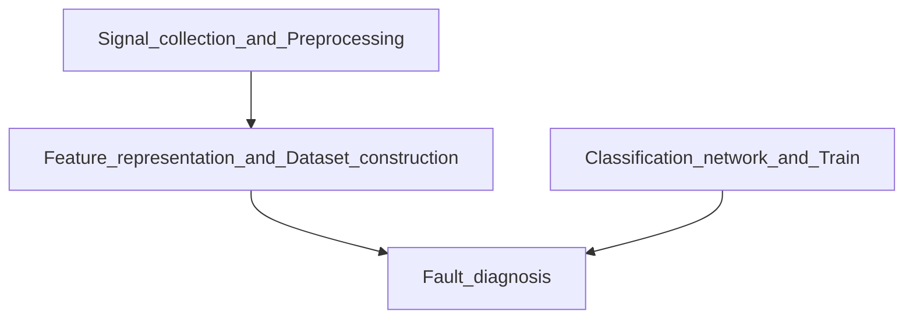

<picture>
 <source media="(prefers-color-scheme: dark)" srcset="[YOUR-DARKMODE-IMAGE](https://user-images.githubusercontent.com/25423296/163456776-7f95b81a-f1ed-45f7-b7ab-8fa810d529fa.png)">
 <source media="(prefers-color-scheme: light)" srcset="[YOUR-LIGHTMODE-IMAGE](https://user-images.githubusercontent.com/25423296/163456779-a8556205-d0a5-45e2-ac17-42d089e3c3f8.png)">
 
</picture>

# About me
<!-- TO DO: add more details about me later -->

Hi, I'm Yang Chen.
- 🔭 I’m currently pursuing postgraduate degree.
- 🌱 I’m currently learning signal processing, voiceprint recognition, data sicence and artificial intelligence.
- 📫 How to reach me: chen1052554665@gmail.com

My top languages

  
| Rank | Languages |
|-----:|---------------|
|     1| Python          |
|     2| Matlab        |
|     3| Java          |
|     4| C++          |

Here is a simple flow chart for my research.
<!-- The mermaid can not input space. -->

---
> Stay hungry, stay foolish.
— Steve Jobs

