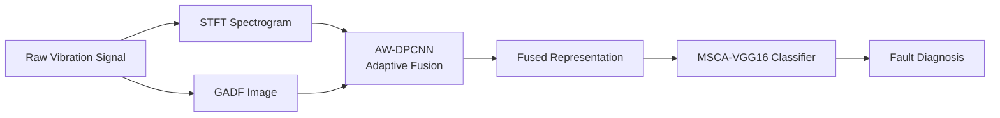
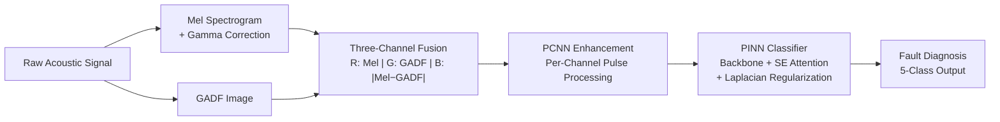
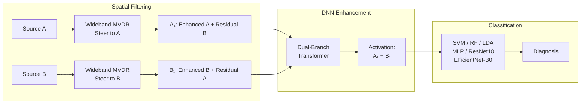

  

<h1 align="center">Chen Yang （杨臣）</h1>

  <strong>M.S. Candidate</strong> | Signal Processing · Deep Learning · Acoustic Fault Diagnosis

  
  
  
  
  
  

## 🎓 About Me

I am a **Master's candidate** in Communication Engineering at **North China Electric Power University (NCEPU)**, specializing in **signal processing** and **deep learning** for industrial acoustic monitoring and fault diagnosis. I am currently applying for a **PhD program** in the field of signal processing and deep learning.

> *"Do not go gentle into that good night."* — Dylan Thomas

My research integrates **machine learning**, **array signal processing**, and **multi-representation fusion** to address real-world challenges in acoustic-based equipment condition monitoring. I have independently led two complete research workflows from problem formulation through experimentation to manuscript preparation.

## 🔬 Research Interests

| Area | Focus |
|------|-------|
| **Acoustic Signal Processing** | Time-frequency analysis, beamforming (MVDR), array signal processing |
| **Deep Learning** | CNN architectures, attention mechanisms, physics-informed neural networks (PINNs) |
| **Multi-Representation Fusion** | PCNN-based adaptive fusion of spectrograms & temporal encodings |
| **Fault Diagnosis** | Rotating machinery & power transformer vibration/acoustic diagnosis |
| **Array Signal Processing** | Multi-arm spiral microphone arrays, spatial filtering, RIR modeling |

## 🚀 Research Projects

### ⭐ Project 1 — AW-DPCNN: Adaptive Multi-Representation Fusion for Fault Diagnosis

A **contrast-guided dual-channel PCNN** that adaptively fuses **STFT spectrograms** (time-frequency domain) and **Gramian Angular Difference Field (GADF)** images (temporal correlation domain) for rotating machinery fault diagnosis. Fused representations are classified by a **multi-scale channel attention enhanced VGG16 (MSCA-VGG16)**.

```mermaid
flowchart LR
    A[Raw Vibration Signal] --> B1[STFT Spectrogram]
    A --> B2[GADF Image]
    B1 --> C[AW-DPCNN<br/>Adaptive Fusion]
    B2 --> C
    C --> D[Fused Representation]
    D --> E[MSCA-VGG16 Classifier]
    E --> F[Fault Diagnosis]
```

**Key Innovations:**
- **Contrast-guided adaptive weighting** ($\gamma=10$): dynamically emphasizes the dominant representation at each spatial location
- **Dual-channel coupling**: representation-specific convolution kernels (stripe $3\times5$ for STFT, symmetric $3\times3$ for GADF)
- **Iterative pulse dynamics** ($N=20$): reinforces structurally consistent features across representations

**Key Results (CWRU 12k DE, 3 trials):**

| Model | Acc (%) | F1 (%) | G-Mean (%) |
|-------|:------:|:-----:|:---------:|
| **MSCA-VGG16 (Ours)** ⭐ | **99.85 ± 0.10** | **99.46 ± 0.43** | **99.82 ± 0.15** |
| VGG16 | 99.19 ± 0.89 | 98.95 ± 1.16 | 98.91 ± 1.22 |
| ResNet18 | 98.39 ± 1.32 | 97.85 ± 1.81 | 97.66 ± 2.10 |
| ConvNeXt-Tiny | 92.93 ± 2.12 | 90.63 ± 2.50 | 88.99 ± 3.11 |

**Generalization:** Cross-sensor (97.45%), cross-sampling-rate (94.81%), strong noise robustness demonstrated.

> 📄 **Manuscript:** *"Adaptive Multi-Representation Fusion via Dual-Channel PCNN with Multi-Scale Convolution for Vibration Signal Fault Diagnosis"* — under review at *Signal, Image and Video Processing*.

### ⭐ Project 2 — PCNN-Enhanced Multi-Representation Fusion with PINN

A **physics-informed deep learning framework** for power transformer acoustic fault diagnosis. The method fuses **Mel spectrograms** and **GADF images** into three-channel RGB representations, enhances them through **Pulse-Coupled Neural Networks (PCNN)** for noise suppression, and classifies faults using **PINN with Laplacian smoothness regularization** derived from the acoustic Helmholtz equation.

```mermaid
flowchart LR
    A[Raw Acoustic Signal] --> B1[Mel Spectrogram<br/>+ Gamma Correction]
    A --> B2[GADF Image]
    B1 --> C["Three-Channel Fusion<br/>R: Mel | G: GADF | B: |Mel−GADF|"]
    B2 --> C
    C --> D[PCNN Enhancement<br/>Per-Channel Pulse Processing]
    D --> E["PINN Classifier<br/>Backbone + SE Attention<br/>+ Laplacian Regularization"]
    E --> F[Fault Diagnosis<br/>5-Class Output]
```

**Key Innovations:**
- **PCNN-based noise suppression**: biologically-inspired pulse-coupled dynamics that preserve fault-induced structures while attenuating background noise
- **Physics-informed regularization**: Laplacian smoothness constraint derived from the acoustic Helmholtz equation ($\nabla^2 p \approx 0$)
- **Three-channel RGB fusion**: Mel (R) + GADF (G) + |Mel − GADF| (B) — a physically interpretable fusion encoding
- **Gamma correction** ($\gamma=1.7$): enhances low-energy spectral regions for subtle fault feature detection

**Key Results (5-fold CV on real 220 kV transformer, 5 conditions):**

| Model Variant | Acc (%) | $F_1^w$ | $G_{\text{mean}}$ |
|--------------|:------:|:-----:|:---------:|
| **(5) Full (SE + PCNN + PINN)** ⭐ | **97.26 ± 0.82** | **0.9715** | **0.9875** |
| (1) Baseline AlexNet | 92.93 ± 1.24 | 0.9281 | 0.9264 |
| Swin-T (SOTA) | 95.82 ± 0.94 | 0.9568 | 0.9689 |

> The full model reduces $\sigma_{F_1}$ by **58%** vs. baseline and outperforms Swin Transformer by **+1.44%** ($p = 0.003$).

> 📄 **Manuscript:** *"PCNN-Enhanced Multi-Representation Fusion with Physics-Informed Learning for Power Transformer Fault Diagnosis"* — under review at *Journal of Failure Analysis and Prevention*.

### ⭐ Project 3 — MVDR-Based Acoustic Source Separation on Multi-Arm Spiral Array (In Progress)

An end-to-end acoustic source separation and classification pipeline combining **wideband MVDR beamforming** on a custom 128-channel multi-arm spiral microphone array with a **dual-branch Transformer** enhanced by a differential activation function ($A_1 - B_1$).

```mermaid
flowchart LR
    subgraph Stage1["Spatial Filtering"]
        A["Source A"] --> MVDR_A["Wideband MVDR<br/>Steer to A"]
        B["Source B"] --> MVDR_B["Wideband MVDR<br/>Steer to B"]
        MVDR_A --> A1["A₁: Enhanced A + Residual B"]
        MVDR_B --> B1["B₁: Enhanced B + Residual A"]
    end
    subgraph Stage2["DNN Enhancement"]
        A1 --> DNN["Dual-Branch<br/>Transformer"]
        B1 --> DNN
        DNN --> DIFF["Activation:<br/>A₁ − B₁"]
    end
    subgraph Stage3["Classification"]
        DIFF --> CLF["SVM / RF / LDA<br/>MLP / ResNet18<br/>EfficientNet-B0"]
        CLF --> RESULT["Diagnosis"]
    end
```

**Key Innovations:**
- **A₁ − B₁ differential activation**: cancels common residual interference by subtracting the interference-steered MVDR output from the target-steered output in the learned feature space
- **128-channel custom spiral array**: optimized geometry for spatial discrimination in reverberant environments
- **Multi-$\beta$ RIR modeling**: comprehensive analysis of wall reflection coefficients on beamforming performance
- **6-model ensemble classification**: SVM, RF, LDA, MLP, ResNet18, EfficientNet-B0 with PCA dimensionality reduction

**Technical Highlights:**
- Fraunhofer far-field steering vector construction
- Wideband MVDR with eigenvalue-based diagonal loading
- Comprehensive eigenspectrum analysis across reflection conditions
- Real acoustic signal validation with physical measurements

> 📄 **Manuscript in preparation.**

## 📈 Research Impact Summary

| Metric | Value |
|--------|-------|
| **Completed Research Workflows** | 2 (end-to-end: data → experiment → manuscript) |
| **Manuscripts Under Review** | 2 |
| **Manuscripts in Preparation** | 1 |
| **Custom Datasets Constructed** | 5+ (CWRU variants, MIMII, real transformer) |
| **Model Architectures Implemented** | 15+ (VGG, ResNet, EfficientNet, ConvNeXt, ViT, Swin-T, AlexNet-SE, PINN variants) |
| **Key Methods Developed** | AW-DPCNN fusion, MSCA-VGG16, PCNN enhancement, PINN Laplacian regularization, A₁−B₁ differential activation |

## 🛠 Technical Skills

### Programming Languages & Frameworks

| Category | Technologies |
|----------|-------------|
| **Deep Learning** | PyTorch, torchvision, TensorBoard |
| **Scientific Computing** | Python, NumPy, SciPy, MATLAB |
| **Signal Processing** | Librosa, SciPy.signal, MATLAB Signal Processing Toolbox |
| **Machine Learning** | Scikit-Learn, SVM, Random Forest, LDA, MLP |
| **General Purpose** | C, Shell/Bash |

### Research Tools

| Category | Tools |
|----------|-------|
| **Experiment Tracking** | TensorBoard, Weights & Biases |
| **Version Control** | Git, GitHub |
| **Environment Management** | Miniconda, Docker, Linux (Ubuntu) |
| **Academic Writing** | LaTeX (IEEE/Elsevier templates), TeXstudio, Overleaf |
| **Reference Management** | Zotero |
| **Knowledge Management** | Obsidian, Notion |
| **Visualization** | Matplotlib, Origin, Draw.io |
| **IDEs** | VS Code, PyCharm, MATLAB |

### Hardware & Infrastructure

| Resource | Specification |
|----------|--------------|
| **GPU** | NVIDIA RTX 5090 (32 GB VRAM) |
| **CUDA** | 12.8 |
| **OS** | Ubuntu Linux |
| **Remote** | SSH, VS Code Remote SSH |

## 📚 Research Methodology

My research follows a systematic, reproducible workflow:

```mermaid
flowchart LR
    A[Problem Definition] --> B[Literature Review]
    B --> C[Method Design]
    C --> D[Dataset Construction]
    D --> E[Experiment Execution]
    E --> F[Result Analysis]
    F --> G[Visualization]
    G --> H[Manuscript Writing]
    H --> I[Revision & Submission]
```

| Phase | Activities | Tools |
|-------|-----------|-------|
| **Data** | Dataset construction, preprocessing, augmentation, splitting | Python, Librosa, MATLAB |
| **Knowledge** | Literature review, note-taking, gap analysis | Obsidian, Zotero, TeXstudio |
| **Experiment** | Model training, ablation studies, benchmarking, hyperparameter tuning | PyTorch, TensorBoard, GPU Server |
| **Project** | Version control, code review, reproducibility | Git, GitHub |
| **Output** | Paper writing, figure generation, revision | LaTeX, Notion, Draw.io |

**Core Philosophy:**
- 📝 **Notion** — task & project management
- 🧠 **Obsidian** — knowledge management & research notes
- 🔧 **GitHub** — engineering & reproducibility
- 🤖 **AI-assisted** — research design, debugging, code generation

## 🤖 AI-Augmented Research

| Tool | Role in My Workflow |
|------|-------------------|
| **ChatGPT / Claude** | Research design, literature synthesis, debugging, academic writing assistance |
| **GitHub Copilot** | Real-time code completion & generation |
| **Claude Code** | Agentic development, codebase refactoring, experiment automation |
| **Warp** | AI-powered terminal for system operations |

## 📫 Contact & Collaboration

I am actively seeking **PhD opportunities** in signal processing, deep learning, and acoustic monitoring. I welcome collaborations and discussions.

- 📧 **Email:** [220242215063@ncepu.edu.cn](mailto:220242215063@ncepu.edu.cn)
- 💼 **LinkedIn:** [linkedin.com/in/chenyang0640](https://www.linkedin.com/in/chenyang0640)
- 💻 **GitHub:** [github.com/1052554665](https://github.com/1052554665)
- 🏫 **Affiliation:** North China Electric Power University (NCEPU), School of Electrical Engineering

  © 2025–2026 Chen Yang. Built with ❤️ for reproducible research.

